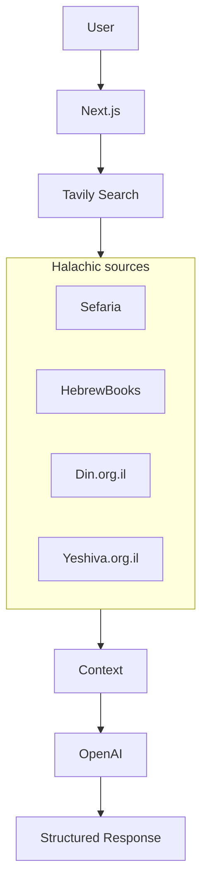

# Halacha.ai

**[→ Live app](https://halacha-ai-cshe.vercel.app/)**

*תשובות הלכתיות מדויקות מהמקורות — AI-powered Halachic search in Hebrew.*

---

## 🎯 Problem

Searching for Halachic answers across multiple sources is time-consuming and often yields fragmented results. Users must visit Sefaria, HebrewBooks, Yeshiva.org.il, and other sites separately, then piece together an answer—without a clear conclusion or unified view.

---

## 💡 Solution

Halacha.ai is an **AI-powered search engine** that aggregates trusted Halachic sources (Sefaria, HebrewBooks, Torat Emet, Yeshiva.org.il, Din.org.il, Moreshet Maran, and more via **Tavily**), then uses **OpenAI** to produce a **single, sourced answer** in Hebrew—with a clear **מסקנה להלכה** (Halachic conclusion) and clickable source links.

---

## ✨ Key Features

### 📚 Knowledge Base

Tavily searches are restricted to the following Halachic sources:

- **Sefaria** — Tanakh, Talmud, and Jewish texts
- **HebrewBooks** — Classic seforim and responsa
- **Torat Emet** — Torah software and texts
- **Yeshiva.org.il** (אתר ישיבה) — Modern Psak and Shiurim
- **Din.org.il** (אתר דין) — Practical Halacha
- **Moreshet Maran** — Sephardic tradition (Yalkut Yosef, Maran Harav Ovadia Yosef)

---

## 🧠 Architecture

End-to-end flow:



| Step | Description |
|------|-------------|
| **User** | Submits a Halachic question in Hebrew. |
| **Next.js** | App (Server Action) receives the query. |
| **Tavily** | Searches the configured Halachic sources (Sefaria, HebrewBooks, Din.org.il, Yeshiva.org.il, etc.). |
| **Context** | Search results are aggregated and passed to OpenAI. |
| **OpenAI** | GPT-4o-mini analyzes context and synthesizes an answer with מסקנה להלכה. |
| **Structured Response** | Answer + source links returned to the user. |

---

## 🛠 Tech Stack

| Layer        | Tech |
|-------------|------|
| **Framework** | Next.js 15 (App Router) |
| **Styling**   | Tailwind CSS |
| **Motion**    | Framer Motion |
| **Search**    | Tavily API |
| **LLM**       | OpenAI (GPT-4o-mini) |
| **Icons**     | Lucide React |
| **Other**     | Python |

---

## ⚙️ Installation

### 1. Install dependencies

From the project root:

```bash
npm install
```

### 2. Environment variables

Create a `.env.local` file in the project root:

```env
TAVILY_API_KEY=your_tavily_api_key
OPENAI_API_KEY=your_openai_api_key
```

- **TAVILY_API_KEY** — [Tavily](https://tavily.com) (search API).
- **OPENAI_API_KEY** — [OpenAI API keys](https://platform.openai.com/api-keys).

### 3. Run locally

```bash
npm run dev
```

Open [http://localhost:3000](http://localhost:3000).

---

## 🚀 Usage

1. **Ask in Hebrew** — Type your Halachic question in the search bar (e.g. blessings, Shabbat, kashrut, tefillah).
2. **Get one answer** — The app searches the configured sources and returns a single, readable answer with a Halachic conclusion.
3. **Use the sources** — Click any source link to open the original text (Sefaria, HebrewBooks, etc.).
4. **History** — Your session history is stored in the browser (localStorage). Use **נקה היסטוריה** to clear it, or click the logo to reset the view and start a fresh search without deleting history.
5. **Dark mode** — Toggle via the sun/moon icon in the header.

---

## 📊 Example

**Query (English):** *What is the blessing for Bamba?*

**Query (Hebrew):** *מה הברכה על במבה?*

The app returns a concise answer with:

- The correct blessing (**בורא מיני מזונות** for Bamba-style snacks).
- Short explanation and context.
- **מסקנה להלכה** — a one- or two-sentence conclusion.
- **מקורות** — links to Sefaria, HebrewBooks, or other configured sources.

---

## 📜 Disclaimer

Answers are generated by AI and based on online sources. They are not a substitute for a Posek; when in doubt, consult a qualified rabbi.

*התשובות מופקות על ידי בינה מלאכותית ומתבססות על מקורות מקוונים. אין להסתמך עליהן כפסק הלכה סופי; בכל ספק יש להתייעץ עם רב מורה הוראה.*
